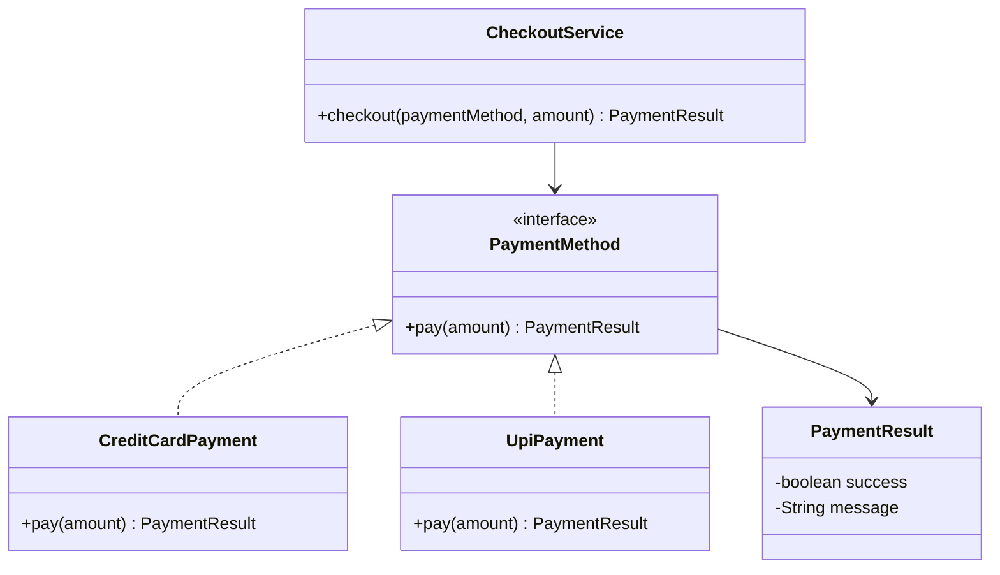

# OOP Principles

Object-Oriented Programming is the foundation of Low-Level Design. In LLD,
OOP is not just about writing classes. It is about assigning responsibilities,
protecting state, creating useful abstractions, and making behavior easy to
extend without breaking existing code.

## Learning Goals

After completing this topic, you should be able to:

- Explain encapsulation, abstraction, inheritance, and polymorphism.
- Identify classes and responsibilities from a short requirement.
- Decide when an object should expose behavior instead of raw data.
- Use interfaces or abstract classes to separate "what" from "how".
- Recognize when inheritance is useful and when composition is safer.

## Why OOP Matters in LLD

LLD turns requirements into concrete software units. OOP helps you answer:

- Which objects exist in the system?
- What responsibility does each object own?
- Which details should be hidden from other objects?
- Which parts of the system should be replaceable?
- How should objects collaborate to complete a use case?

Good OOP design makes code easier to test, extend, debug, and explain in an
interview.

## The Four Pillars

### 1. Encapsulation

Encapsulation means keeping an object's internal state private and exposing
controlled behavior through methods.

Instead of allowing other code to directly change data, the object protects its
own rules.

### Bad Example

```java
class BankAccount {
    public double balance;
}

class Main {
    public static void main(String[] args) {
        BankAccount account = new BankAccount();
        account.balance = -5000;
    }
}
```

This design allows invalid state. A bank account should not become negative
unless the domain explicitly supports overdraft.

### Better Example

```java
class BankAccount {
    private double balance;

    public BankAccount(double openingBalance) {
        if (openingBalance < 0) {
            throw new IllegalArgumentException("Opening balance cannot be negative");
        }
        this.balance = openingBalance;
    }

    public void deposit(double amount) {
        if (amount <= 0) {
            throw new IllegalArgumentException("Deposit amount must be positive");
        }
        balance += amount;
    }

    public void withdraw(double amount) {
        if (amount <= 0 || amount > balance) {
            throw new IllegalArgumentException("Invalid withdrawal amount");
        }
        balance -= amount;
    }

    public double getBalance() {
        return balance;
    }
}
```

### LLD Takeaway

Encapsulation is about protecting business rules. Put validation and state
changes inside the object that owns the data.

### 2. Abstraction

Abstraction means exposing only essential behavior while hiding implementation
details.

Clients should depend on what an object can do, not how it does it.

### Example

```java
interface PaymentMethod {
    PaymentResult pay(double amount);
}

class CreditCardPayment implements PaymentMethod {
    @Override
    public PaymentResult pay(double amount) {
        return new PaymentResult(true, "Paid using credit card");
    }
}

class UpiPayment implements PaymentMethod {
    @Override
    public PaymentResult pay(double amount) {
        return new PaymentResult(true, "Paid using UPI");
    }
}

class CheckoutService {
    public PaymentResult checkout(PaymentMethod paymentMethod, double amount) {
        return paymentMethod.pay(amount);
    }
}
```

The checkout flow does not need to know the exact payment implementation.

### LLD Takeaway

Use abstraction when the system has multiple possible implementations for the
same responsibility.

### 3. Inheritance

Inheritance lets one class reuse or specialize behavior from another class.
It models an "is-a" relationship.

### Example

```java
abstract class Notification {
    private final String recipient;

    protected Notification(String recipient) {
        this.recipient = recipient;
    }

    public String getRecipient() {
        return recipient;
    }

    public abstract void send(String message);
}

class EmailNotification extends Notification {
    public EmailNotification(String recipient) {
        super(recipient);
    }

    @Override
    public void send(String message) {
        System.out.println("Sending email to " + getRecipient() + ": " + message);
    }
}

class SmsNotification extends Notification {
    public SmsNotification(String recipient) {
        super(recipient);
    }

    @Override
    public void send(String message) {
        System.out.println("Sending SMS to " + getRecipient() + ": " + message);
    }
}
```

### Use Inheritance When

- The child truly is a specialized version of the parent.
- Shared behavior is stable and belongs in the parent.
- Subclasses can replace the parent without surprising behavior.

### Avoid Inheritance When

- The relationship is "has-a" instead of "is-a".
- You only want code reuse.
- Subclasses need to override most parent behavior.

### LLD Takeaway

Prefer composition for flexible designs. Use inheritance carefully when the
domain relationship is strong and stable.

### 4. Polymorphism

Polymorphism means the same interface can trigger different behavior depending
on the actual object.

### Example

```java
class PaymentProcessor {
    public void process(PaymentMethod paymentMethod, double amount) {
        PaymentResult result = paymentMethod.pay(amount);
        System.out.println(result.getMessage());
    }
}
```

The processor works with any `PaymentMethod`: credit card, UPI, wallet, net
banking, or a future payment method that does not exist yet.

### LLD Takeaway

Polymorphism removes large conditional blocks and makes new behavior easier to
add.

## Mini LLD Example: Payment Checkout

### Requirement

Design a simple checkout flow where a customer can pay using different payment
methods. The system should support adding new payment methods later.

### Core Objects

| Object | Responsibility |
| ------ | -------------- |
| `PaymentMethod` | Defines the common payment behavior |
| `CreditCardPayment` | Handles credit card specific payment |
| `UpiPayment` | Handles UPI specific payment |
| `PaymentResult` | Represents success or failure of a payment |
| `CheckoutService` | Coordinates checkout using a payment method |

### Class Diagram



### Complete Example

```java
class PaymentResult {
    private final boolean success;
    private final String message;

    public PaymentResult(boolean success, String message) {
        this.success = success;
        this.message = message;
    }

    public boolean isSuccess() {
        return success;
    }

    public String getMessage() {
        return message;
    }
}

interface PaymentMethod {
    PaymentResult pay(double amount);
}

class CreditCardPayment implements PaymentMethod {
    private final String cardNumber;

    public CreditCardPayment(String cardNumber) {
        this.cardNumber = cardNumber;
    }

    @Override
    public PaymentResult pay(double amount) {
        if (amount <= 0) {
            return new PaymentResult(false, "Amount must be positive");
        }
        return new PaymentResult(true, "Credit card payment completed");
    }
}

class UpiPayment implements PaymentMethod {
    private final String upiId;

    public UpiPayment(String upiId) {
        this.upiId = upiId;
    }

    @Override
    public PaymentResult pay(double amount) {
        if (amount <= 0) {
            return new PaymentResult(false, "Amount must be positive");
        }
        return new PaymentResult(true, "UPI payment completed");
    }
}

class CheckoutService {
    public PaymentResult checkout(PaymentMethod paymentMethod, double amount) {
        if (paymentMethod == null) {
            throw new IllegalArgumentException("Payment method is required");
        }
        return paymentMethod.pay(amount);
    }
}
```

## How to Identify Classes From Requirements

Use this process during LLD interviews and practice:

1. Highlight nouns in the requirement.
2. Remove vague nouns that do not own behavior.
3. Convert important domain nouns into candidate classes.
4. Assign each class one primary responsibility.
5. Identify relationships between classes.
6. Add methods based on actions the system must perform.
7. Hide internal state and expose behavior.

### Example

Requirement:

> A library member can borrow a book if the book is available.

Candidate classes:

| Candidate | Keep? | Reason |
| --------- | ----- | ------ |
| `LibraryMember` | Yes | Owns borrowing behavior |
| `Book` | Yes | Owns book availability |
| `BorrowingRecord` | Yes | Tracks borrow history |
| `Available` | No | Better as book state or field |

## OOP Design Checklist

Before finalizing a class design, ask:

- Does each class have one clear responsibility?
- Are fields private unless there is a strong reason otherwise?
- Are validations placed close to the state they protect?
- Are interfaces used where behavior can vary?
- Is inheritance modeling a real "is-a" relationship?
- Can new behavior be added without editing many existing classes?
- Are method names based on domain actions?

## Common Mistakes

| Mistake | Why It Hurts | Better Approach |
| ------- | ------------ | --------------- |
| Public mutable fields | Any caller can break object rules | Use private fields and behavior methods |
| God classes | One class becomes hard to test and change | Split by responsibility |
| Inheritance for code reuse only | Creates rigid class hierarchies | Prefer composition |
| Too many getters and setters | Objects become data bags | Expose meaningful actions |
| Large if-else blocks for type behavior | Hard to extend safely | Use polymorphism |

## Practice Tasks

Complete these before moving to SOLID principles:

1. Design a `BankAccount` class with deposit, withdraw, and balance inquiry.
2. Add validation so invalid transactions cannot corrupt the account.
3. Create `PaymentMethod` implementations for card, UPI, and wallet payments.
4. Write a short class diagram for the payment flow.
5. Explain where each OOP pillar appears in your design.

## Completion Criteria

Mark this topic complete only when:

- You can explain all four OOP pillars without notes.
- You have implemented at least one small example.
- Your example hides state and exposes behavior.
- You can explain why an interface or abstract class was used.
- You can identify at least one place where composition is better than
  inheritance.

## Next Topic

After OOP Principles, continue with:

- SOLID Principles
- UML Diagrams
- Object Modeling
